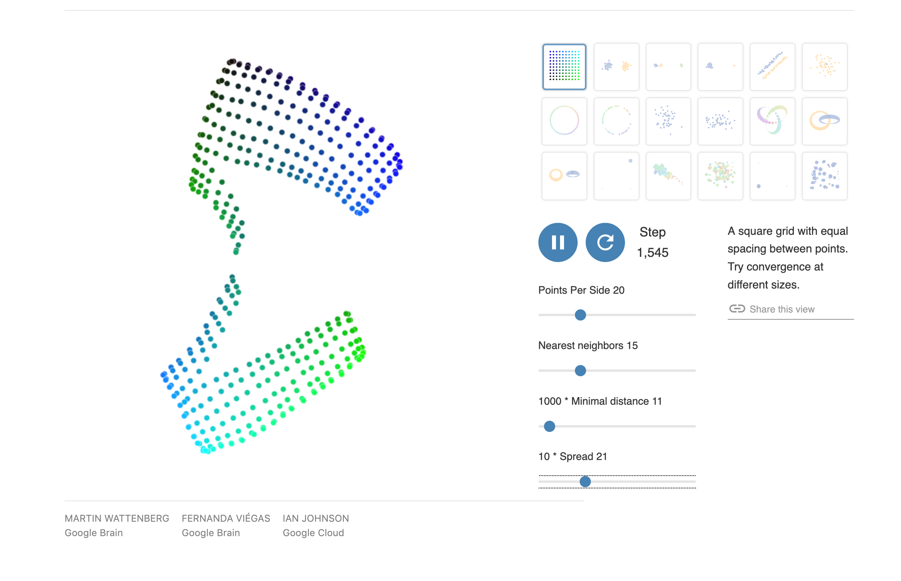
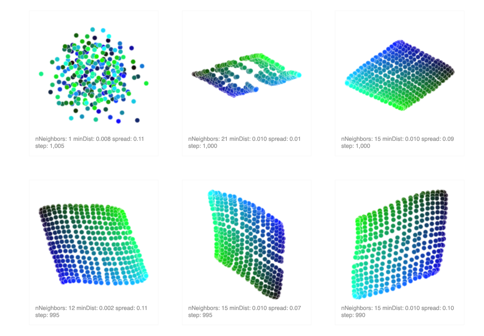
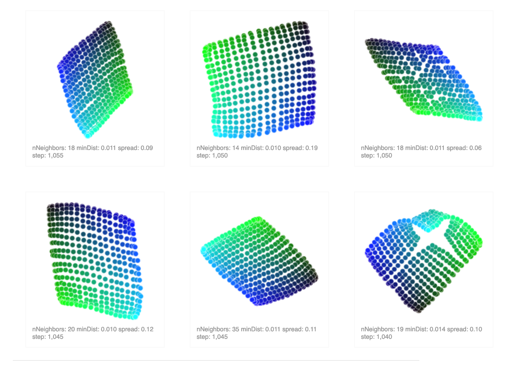
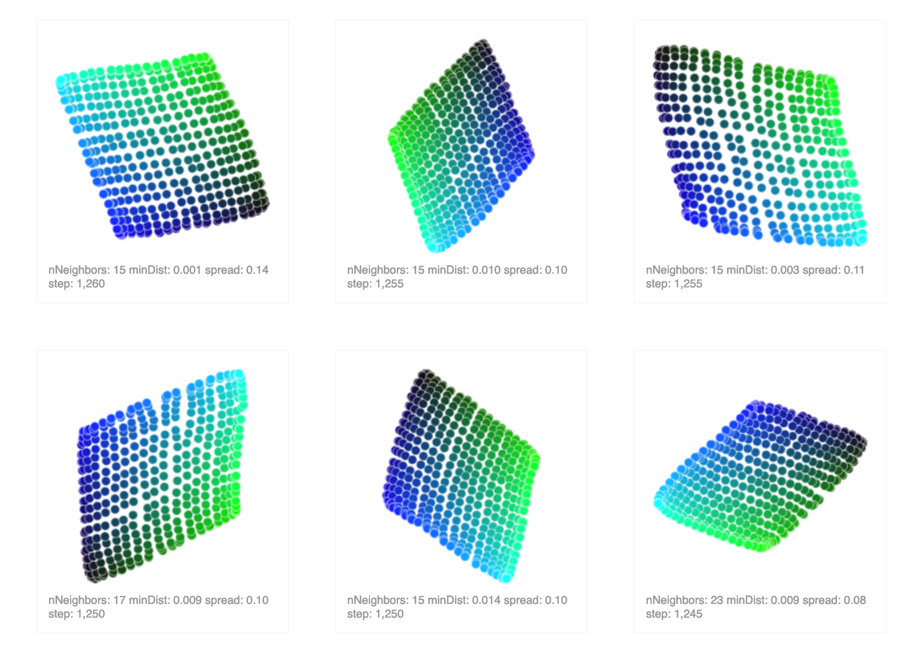

# umap-playground
fiddling with adapting [this awesome work](https://distill.pub/2016/misread-tsne/) with [umap](https://arxiv.org/abs/1802.03426) using [umap-js](https://github.com/PAIR-code/umap-js)


## some screenshots








# dev
### app
serve .
### generator
requires `node-canvas`, which requires installing or building some binary dependencies, see https://github.com/Automattic/node-canvas

```
cd generator
yarn install
yarn build
```
